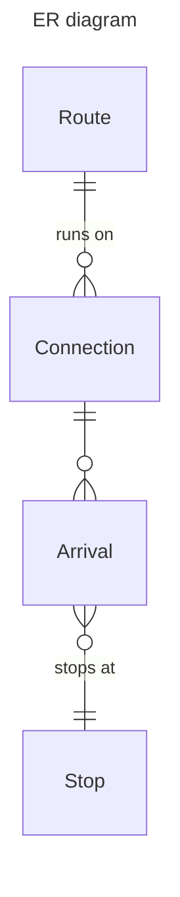
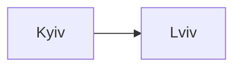
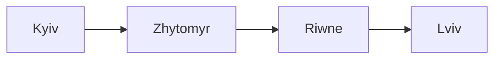
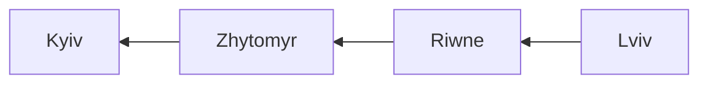
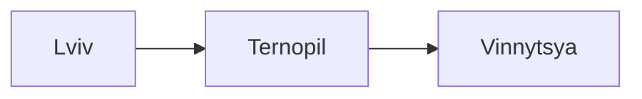
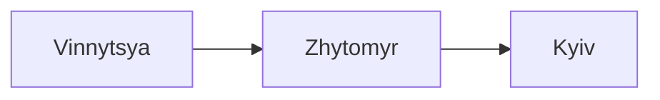
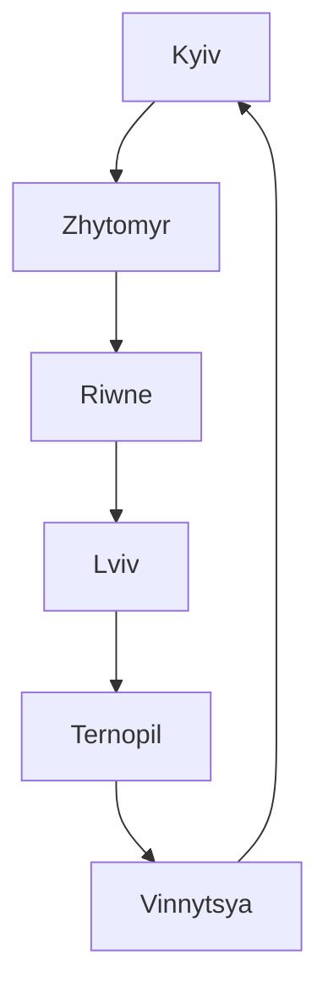

# Data models (work in progress)

**Route**

| column name | description | example |
|-------------|-------------|----------|
| `id` | primary key | `1` |
| `name` | Route name | '376', 'M1' |
| `connections` | One-to-many relation to `Connection` | |

**Connection**

| column name | description | example |
|-------------|-------------|----------|
| `id` | primary key | `1` |
| `departure_cron` | the time when route departs | '5,30 6-22 * * Wed' |
| `waypoints` | One-to-many relation to `Waypoint` |  |
| `route` | Many-to-one relation to `Route` |  |

**Waypoint**

| column name | description | example |
|-------------|-------------|----------|
| `id` | primary key | `1` |
| `station` | Many-to-one relation to `Station` | 'Politekhnichnyi instytut' |
| `connection` | Many-to-one relation to `Connection` | |
| `trip_time` | time in seconds from departure to stop | '60', '3850' |

**Station**

| column name | description | example |
|-------------|-------------|----------|
| `id` | primary key | `1` |
| `name` | Stop full name | 'Politekhnichnyi instytut' |
| `waypoints` | One-to-many relation to `Waypoint` |  |

### Route examples

#### №1

Route has only two stops, for example from Kyiv to Lviv that departures at 11:30 on 1, 10 and 20 day of month.

**Route**
| id | name |
|-------------|----------|
| 1 | Kyiv-Lviv |

**Connection**
| id | route_id | departure_stop | departure_time |
|-------------|-------------|----------|----------|
| 1 | 1 | 1 | '30 11 1,10,20 * *' |

**Arrival**
| id | connection_id | next_stop | stop_time |
|-------------|-------------|----------|----------|
| 1 | 1 | 2 | 492 |

**Stop**
| id | name |
|-------------|-------------|
| 1 | Kyiv |
| 2 | Lviv |

#### №2

Route has 4 stops: Kyiv, Zhytomyr, Riwne, Lviv. It departures every day at 7:00 and 19:00 from Kyiv and at 9:00 and 21:00 from Lviv.

**Route**
| id | name |
|-------------|----------|
| 1 | Kyiv-Lviv |

**Connection**

| id | route_id | departure_stop | departure_time |
|-------------|-------------|----------|----------|
| 1 | 1 | 1 | '0 7,19 * * * ' |
| 2 | 1 | 4 | '0 9,21 * * * ' |

**Arrival**
| id | connection_id | next_stop | stop_time |
|-------------|-------------|----------|----------|
| 1 | 1 | 2 | 154 |
| 2 | 1 | 3 | 301 |
| 3 | 1 | 4 | 495 |
| 4 | 2 | 3 | 207 |
| 5 | 2 | 2 | 350 |
| 6 | 2 | 1 | 488 |

**Stop**
| id | name |
|-------------|-------------|
| 1 | Kyiv |
| 2 | Zhytomyr |
| 3 | Riwne |
| 4 | Lviv |

#### №3

Route has 6 stops: Kyiv, Zhytomyr, Riwne, Lviv, Ternopil, Vinnytsya. It departures every day at 7:00 and 19:00 from Kyiv, at 9:00 and 21:00 from Lviv and at 8:00 and 20:00 from Vinnytsya.

**Route**
| id | name |
|-------------|----------|
| 1 | 567 |

**Connection**

| id | route_id | departure_stop | departure_time |
|-------------|-------------|----------|----------|
| 1 | 1 | 1 | '0 7,19 * * * ' |
| 2 | 1 | 4 | '0 9,21 * * * ' |
| 3 | 1 | 6 | '0 8,20 * * * ' |

**Arrival**
| id | connection_id | next_stop | stop_time |
|-------------|-------------|----------|----------|
| 1 | 1 | 2 | 154 |
| 2 | 1 | 3 | 301 |
| 3 | 1 | 4 | 495 |
| 4 | 2 | 5 | 119 |
| 5 | 2 | 6 | 328 |
| 6 | 3 | 2 | 118 |
| 7 | 3 | 1 | 240 |

**Stop**
| id | name |
|-------------|-------------|
| 1 | Kyiv |
| 2 | Zhytomyr |
| 3 | Riwne |
| 4 | Lviv |
| 5 | Ternopil |
| 6 | Vinnytsya |

#### №4

Route is circular and has 6 stops: Kyiv, Zhytomyr, Riwne, Lviv, Ternopil, Vinnytsya. It departures every day at 7:00 and 19:00 from Kyiv.

**Route**
| id | name |
|-------------|----------|
| 1 | 567 |

**Connection**

| id | route_id | departure_stop | departure_time |
|-------------|-------------|----------|----------|
| 1 | 1 | 1 | '0 7,19 * * * ' |

**Arrival**
| id | connection_id | next_stop | stop_time |
|-------------|-------------|----------|----------|
| 1 | 1 | 2 | 154 |
| 2 | 1 | 3 | 301 |
| 3 | 1 | 4 | 495 |
| 4 | 1 | 5 | 614 |
| 5 | 1 | 6 | 823 |
| 7 | 1 | 1 | 1081 |

**Stop**
| id | name |
|-------------|-------------|
| 1 | Kyiv |
| 2 | Zhytomyr |
| 3 | Riwne |
| 4 | Lviv |
| 5 | Ternopil |
| 6 | Vinnytsya |
