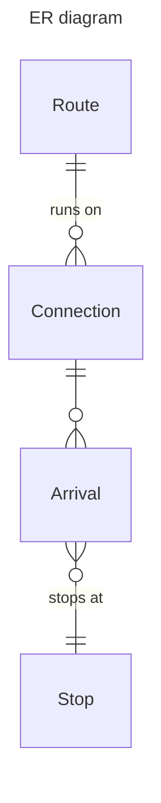
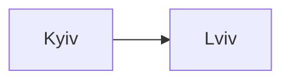
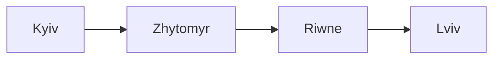
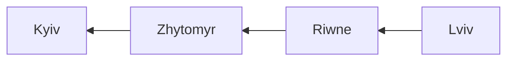
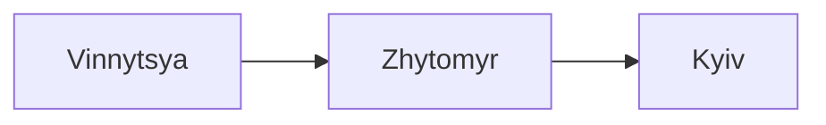
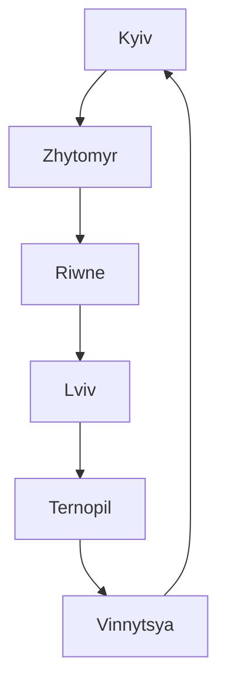

# Data models (work in progress)

**Route**

| column name | description | example |
|-------------|-------------|----------|
| `id` | primary key | `1` |
| `name` | route name | '376', 'M1' |
| `connections` | one-to-many relation to `Connection` | |

**Connection**

| column name | description | example |
|-------------|-------------|----------|
| `id` | primary key | `1` |
| `name` | name for this connection | '376-A', 'M1 weekend' |
| `departure_cron` | the time when route departs | '5,30 6-22 * * Wed' |
| `first_stop` | one-to-many relation to `Station` | 'Heroiv Dnipra' |
| `disabled` | field showing if the connection is not used | 'True' |
| `waypoints` | one-to-many relation to `Waypoint` |  |
| `route` | many-to-one relation to `Route` |  |

**Waypoint**

| column name | description | example |
|-------------|-------------|----------|
| `id` | primary key | `1` |
| `station` | many-to-one relation to `Station` | 'Politekhnichnyi instytut' |
| `connection` | many-to-one relation to `Connection` | |
| `trip_time` | time in seconds from departure to stop | '60', '3850' |
| `disabled` | field showing if the waypoint is not used | 'True' |

**Station**

| column name | description | example |
|-------------|-------------|----------|
| `id` | primary key | `1` |
| `name` | stop full name | 'Politekhnichnyi instytut' |
| `city` | city where `Station` is located | 'Kyiv' |
| `latitude` | latitude of a station | 48.8566 |
| `longtitude` | longtitude of a station | 2.3522 |
| `waypoints` | one-to-many relation to `Waypoint` |  |

### Route examples

#### №1

Route has only two stops, for example from Kyiv to Lviv that 
departures at 11:30 on 1, 10 and 20 day of month.

**Route**

| id | name | connections |
|-------------|----------|----------|
| 1 | Kyiv-Lviv | connection 1 |

**Connection**

| id | name | departure_cron | first_stop | disabled | waypoints | route | 
|-------------|-------------|----------|----------|----------|----------|----------|
| 1 | 'Kyiv-Lviv' | '30 11 1,10,20 * * ' | station 1 |False | waypiont 1 | route 1 | 

**Waypoint**

| id | station | connection | trip_time | disabled |
|-------------|-------------|----------|----------|----------|
| 1 | station 2 | connection 1 | 492 | False |

**Station**

| id | name | city | latitude | longtitude | waypoints |
|-------------|-------------|-------------|-------------|-------------|-------------|
| 1 | 'Kyiv central station' | Kyiv | 50.45| 30.523333 | waypoint 1 | 
| 2 | 'Lviv central station' | Lviv | 49.8425 | 24.032222 | waypoint 1 |

#### №2

Route has 4 stops: Kyiv, Zhytomyr, Riwne, Lviv. It departures every 
day at 7:00 and 19:00 from Kyiv and at 9:00 and 21:00 from Lviv.

**Route**

| id | name | connections |
|-------------|----------|----------|
| 1 | Kyiv-Lviv | connection 1, connection 2 |

**Connection**

| id | name | departure_cron | first_stop | disabled | waypoints | route | 
|-------------|-------------|----------|----------|----------|----------|----------|
| 1 | 'Kyiv-Lviv' | '0 7,19 * * * ' | station 1 | False | waypoint 1, waypoint 2, waypoint 3 | route 1 |
| 2 | 'Lviv-Kyiv' | '0 9,21 * * * ' | station 4 | False | waypoint 4, waypoint 5, waypoint 6 | route 1 |

**Waypoint**

| id | station | connection | trip_time | disabled |
|-------------|-------------|----------|----------|----------|
| 1 | station 2 | connection 1 | 154 | False |
| 2 | station 3 | connection 1 | 301 | False |
| 3 | station 4 | connection 1 | 495 | False |
| 4 | station 3 | connection 2 | 207 | False |
| 5 | station 2 | connection 2 | 350 | False |
| 6 | station 1 | connection 2 | 488 | False |

**Station**

| id | name | city | latitude | longtitude | waypoints |
|-------------|-------------|-------------|-------------|-------------|-------------|
| 1 | 'Kyiv' | Kyiv | 50.45 | 30.523333 | waypoint 6|
| 2 | 'Zhytomyr' | Zhytomyr | 50.25 | 28.666667 | waypoint 1, waypoint 5 |
| 3 | 'Riwne' | Riwne | 50.619167 | 26.251944 | waypoint 2, waypoint 4|
| 4 | 'Lviv' | Lviv | 49.8425 | 24.032222 | waypoint 3 |

#### №3

Route has 6 stops: Kyiv, Zhytomyr, Riwne, Lviv, Ternopil, Vinnytsya. 
It departures every day at 7:00 and 19:00 from Kyiv, at 9:00 and 
21:00 from Lviv and at 8:00 and 20:00 from Vinnytsya.

**Route**

| id | name | connections |
|-------------|----------|----------|
| 1 | 567 | connection 1, connection 2, connection 3 |

**Connection**

| id | name | departure_cron | first_stop | disabled | waypoints | route | 
|-------------|-------------|----------|----------|----------|----------|----------|
| 1 | 'Kyiv-Lviv' | '0 7,19 * * * ' | stop 1 | False | waypoint 1, waypoint 2, waypoint 3 | route 1 |
| 2 | 'Lviv-Vinnytsya' | '0 9,21 * * * ' | stop 4 | False | waypoint 4, waypoint 5 | route 1 |
| 3 | 'Vinnytsya-Kyiv' | '0 8,20 * * * ' | stop 6 | False | waypoint 6, waypoint 7 | route 1 |

**Waypoint**

| id | station | connection | trip_time | disabled |
|-------------|-------------|----------|----------|----------|
| 1 | station 2 | connection 1 | 154 | False |
| 2 | station 3 | connection 1 | 301 | False |
| 3 | station 4 | connection 1 | 495 | False |
| 4 | station 5 | connection 2 | 119 | False |
| 5 | station 6 | connection 2 | 328 | False |
| 6 | station 2 | connection 3 | 118 | False |
| 7 | station 1 | connection 3 | 240 | False |

**Station**

| id | name | city | latitude | longtitude | waypoints |
|-------------|-------------|-------------|-------------|-------------|-------------|
| 1 | 'Kyiv' | Kyiv | 50.45 | 30.523333 | waypoint 7 |
| 2 | 'Zhytomyr' | Zhytomyr | 50.25 | 28.666667 | waypoint 1, waypoint 6 |
| 3 | 'Riwne' | Riwne | 50.619167 | 26.251944 | waypoint 2 |
| 4 | 'Lviv' | Lviv | 49.8425 | 24.032222 | waypoint 3 |
| 5 | 'Ternopil' | Ternopil | 49.566667 | 25.6 | waypoint 4 |
| 6 | 'Vinnytsya' | Vinnytsya | 49.233333 | 28.483333 | waypoint 5 |

#### №4

Route is circular and has 6 stops: Kyiv, Zhytomyr, Riwne, Lviv, 
Ternopil, Vinnytsya. It departures every day at 7:00 and 19:00 from 
Kyiv.

**Route**

| id | name | connections |
|-------------|----------|----------|
| 1 | '567' | connection 1 | 

**Connection**

| id | name | departure_cron | first_stop | disabled | waypoints | route | 
|-------------|-------------|----------|----------|----------|----------|----------|
| 1 | '567' | '0 7,19 * * * ' | stop 1 | False | waypoint 1, waypoint 2, waypoint 3, waypoint 4, waypoint 5, waypoint 6, waypoint 7 | route 1 |

**Waypoint**

| id | station | connection | trip_time | disabled |
|-------------|-------------|----------|----------|----------|
| 1 | station 2 | connection 1 | 154 | False |
| 2 | station 3 | connection 1 | 301 | False |
| 3 | station 4 | connection 1 | 495 | False |
| 4 | station 5 | connection 1 | 614 | False |
| 5 | station 6 | connection 1 | 823 | False |
| 6 | station 1 | connection 1 | 1081 | False |

**Station**

| id | name | city | latitude | longtitude | waypoints |
|-------------|-------------|-------------|-------------|-------------|-------------|
| 1 | 'Kyiv' | Kyiv | 50.45 | 30.523333 | waypoint 7 |
| 2 | 'Zhytomyr' | Zhytomyr | 50.25 | 28.666667 | waypoint 1 |
| 3 | 'Riwne' | Riwne | 50.619167 | 26.251944 | waypoint 2 |
| 4 | 'Lviv' | Lviv | 49.8425 | 24.032222 | waypoint 3 |
| 5 | 'Ternopil' | Ternopil | 49.566667 | 25.6 | waypoint 4 |
| 6 | 'Vinnytsya' | Vinnytsya | 49.233333 | 28.483333 | waypoint 5 |
